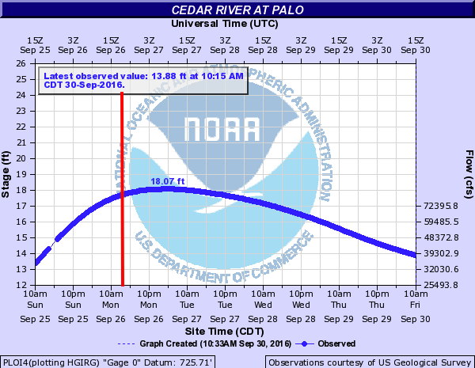
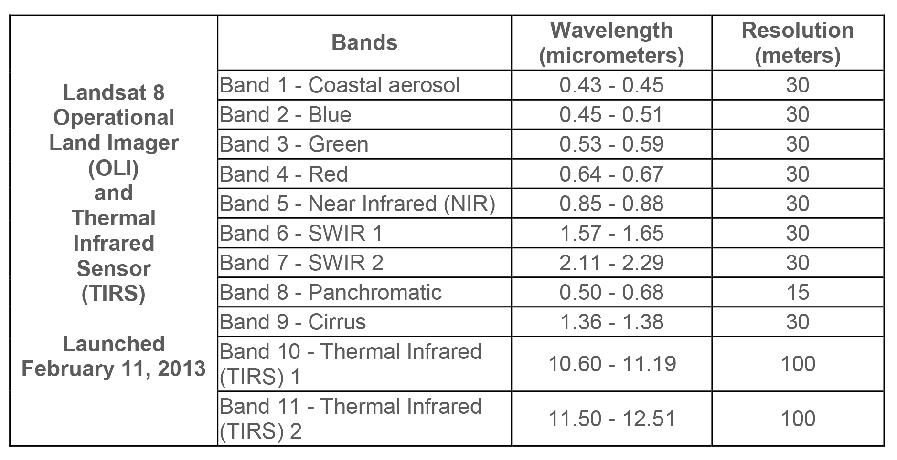

```{r, echo = FALSE, eval = TRUE}
#| fig-align: "center"
#| out.width: "100%"
knitr::include_graphics('img/05-flood-map.jpg')
```

# Background

On September 26, 2016 at 11:47 a.m. U.S. Central Daylight Time (16:47 UTC) the Cedar and Wapsipinicon rivers in Iowa surged producing a flood wave that breached the river banks. The water level of the Cedar River measured ~20 feet — 8 feet above flood stage—near the city of Cedar Rapids. 

The water level continued to rise until it peaked at ~22 feet on September 27. This event had only been exceeded once, in June 2008, when thousands of people were encouraged to evacuate from Cedar Rapids, the second-most-populous city in Iowa.

```{r, echo = FALSE, eval = TRUE}
#| fig-align: "center"
#| out.width: "60%"

```

In this lab we are interested in the impacts in Palo Iowa because it is up stream of Cedar Rapids, contains a large amount of farm land, and does not have a forecast location to provide warning.

We will use the `terra` and `rstac` packages - along with our understanding of raster data and categorization - to create flood images using mutliband Landsat Imagery, thresholding, and classification methods.

## Libraries

```{r}
#| echo: true
#| message: false
library(AOI)
library(rstac) # STAC API
library(terra) # Raster Data handling
library(sf) # Vector data processing
library(mapview) # Rapid Interactive visualization
```

Almost all remote sensing / image analysis begins with the same basic steps:

  1. Identify an area of interest (AOI)
  
  2. Identify the temporal range of interest
  
  3. Identify the relevant images
  
  4. Download the images
  
  5. Analyze the products

## Step 1: AOI identification

First we need to identify an AOI. We want to be able to extract the flood extents for Palo, Iowa and its surroundings. To do this we will use the geocoding capabilities within the `AOI` package.

```{r}
palo <- geocode("Palo, Iowa", bbox = TRUE)

mapview(palo)
```

## Step 2: Temporal identification

The flood event occurred on September 26, 2016. A primary challenge with remote sensing is the fact that all satellite imagery is not available at all times. In this case Landsat 8 has an 8 day revisit time. To ensure we capture an image within the date of the flood, lets set our time range to the period between September 24th - 29th of 2016. We will define this duration in the form `YYYY-MM-DD/YYYY-MM-DD`.

```{r}
temporal_range <- "2016-09-24/2016-09-29"
```


## Step 3: Identifying the relevant images

The next step is to identify the images that are available for our AOI and time range. This is where the `rstac` package comes in. The `rstac` package provides a simple interface to the SpatioTemporal Asset Catalog (STAC) API, which is a standard for discovering and accessing geospatial data.

STAC is a specification for describing geospatial data in a consistent way, making it easier to discover and access datasets. It provides a standardized way to describe the metadata of geospatial assets, including their spatial and temporal extents, data formats, and other relevant information.

  - **Catalog**: A catalog is a collection of STAC items and collections. It serves as a top-level container for organizing and managing geospatial data. A catalog can contain multiple collections, each representing a specific dataset or group of related datasets.
  
  - **Items**: The basic unit of data in STAC. Each item represents a single asset, such as a satellite image or a vector dataset. Items contain metadata that describes the asset, including its spatial and temporal extents, data format, and other relevant information.
  
  - **Asset**: An asset is a specific file or data product associated with an item. For example, a single satellite image may have multiple assets, such as different bands or processing levels. Assets are typically stored in a cloud storage system and can be accessed via URLs.

For this project we are going to use a STAC catalog to identify the data available for our analysis. We want data from the Landsat 8 collection which is served by the USGS (via AWS), Google, and Microsoft Planetary Computer (MPC). MPC is the one that provides free access so we will use that data store.

If you go to this [link](https://planetarycomputer.microsoft.com/api/stac/v1) you see the JSON representation of the full data holdings. If you CMD/CTL+F on that page for `Landsat` you'll find the references for the available data stores.

Within R, we can open a connection to this endpoint with the `stac` function:

```{r}
# Open a connection to the MPC STAC API
(stac_query <- stac("https://planetarycomputer.microsoft.com/api/stac/v1"))
```

That connection will provide an open entry to ALL data hosted by MPC. The `stac_search` function allows us to reduce the catalog to assets that match certain criteria (just like `dplyr::filter` reduces a `data.frame`). The `get_request()` function sends your search to the STAC API returning the metadata about the objects that match a criteria. The service implementation at MPC sets a return limit of 250 items (but it could be overridden with the limit parameter).

Here, we are interested in the "Landsat Collection 2 Level-2" data. From the JSON file (seen in the browser). To start, lets  search for that collection using the `stac` -> `stac_search` --> `get_request` workflow refining your search to our AOI and time range of interest.

The last thing we need to do, is sign this request. In `rstac`, `items_sign(sign_planetary_computer())` signs STAC item asset URLs retrieved from Microsoft's Planetary Computer, ensuring they include authentication tokens for access. `sign_planetary_computer()` generates the necessary signing function, and `items_sign()` applies it to STAC items. This is essential for accessing datasets hosted on the Planetary Computer, and other catalog were data access might be requester-paid or limited.

```{r}
# Search for Landsat 8 data in the specified AOI and time range
stac_query <- stac("https://planetarycomputer.microsoft.com/api/stac/v1") %>%
  stac_search(
    collections = "landsat-c2-l2",
    datetime = temporal_range,
    bbox = st_bbox(palo),
    limit = 1) %>%
  get_request() %>%
  items_sign(sign_planetary_computer())
```

With that, we are ready to download the data using `assets_download()`. In total, a Landsat 8 item has the following 11 bands: 

```{r, echo = FALSE}

```

For this lab, lets just get the first 6 bands. Assets are extracted from a STAC item by the asset name (look at the print statements of the stac_query). Let's define a vector of the assets we want:

```{r}
# Bands 1-6
bands <- c('coastal', 'blue', 'green', 'red', 'nir08', 'swir16')
```

Now we can use the `assets_download()` function to download the data. The `output_dir` argument specifies where to save the files, and the `overwrite` argument specifies whether to overwrite existing files with the same name.

```{r}
# Download the specified bands
assets_download(items = stac_query, 
                asset_names = bands, 
                output_dir = "data", 
                overwrite = T)

```

And that does it! You now have the process needed to get you data.

With a set of local files, you can create a raster object! Remember your files need to be in the order of the bands (double check step 2). 
 - `list.files()` can search a directory for a `pattern` and return a list of files. The `recursive` argument will search all sub-directories. The `full.names` argument will return the full path to the files.

 - The `rast()` function will read the files into a raster object. 
 
 - The `setNames()` function will set the names of the bands to the names we defined above.
 
```{r}
# List downloaded tif files
ras_files <- list.files(
  path = "data/landsat-c2/level-2/standard/oli-tirs",
  pattern = "*.TIF$",
  full.names = TRUE,
  recursive = TRUE
)

# Sort bands
ras_files <- sort(ras_files)[1:6]

l8_stack <- rast(ras_files)

band_names <- c('coastal', 'blue', 'green', 'red', 'nir08', 'swir16')

l8_stack <- setNames(l8_stack, band_names)

l8_stack
```

# Question 1: Data Access

Download all the data needed for this lab. What are the dimensions of your stacked image? What is the CRS? What is the cell resolution?
> Our Landsat 8 stack has a dimension of 7801 rows x 7681 columns x  6 layers (bands), a cell resolution of 30 meters, and a CRS of EPSG:32615.

## Step 5: Analyize the images

We only want to analyze our image for the regions surrounding Palo (our AOI). Transform your AOI to the CRS of the landsat stack and use it to crop your raster stack.

```{r}
aoi_utm <- st_transform(palo, crs = crs(l8_stack))

l8_crop <- crop(l8_stack, aoi_utm)

l8_crop
```


Awesome! We have now (1) identified, (2) downloaded, and (3) saved our images.

We have loaded them as a multiband `SpatRast` object and cropped the domain to our AOI. Lets make a few RGB plots to see what these images reveal. 


:::{.callout-note}
There are many online examples that discuss the applications of the available bands in Landsat. What we want to do here is simply show how loading different combinations into the RGB channels make different features stand out. A useful reference of popular band combinations is [here](https://www.nv5geospatialsoftware.com/Learn/Blogs/Blog-Details/the-many-band-combinations-of-landsat-8).
:::

# Question 2: Data Visualization

Standard cameras replicate whats seen with the human eye, by capturing light in the red, green and blue wavelengths and applying red, green ,and blue filters (channels) to generate a natural looking RGB image. 

With a multispectral Landsat 8 image, we have more information to work with and different wavelengths/combinations can help isolate particular features. 

For example, the Near Infrared (NIR) wavelength is commonly used to analysis vegetation health because vegetation reflects strongly in this portion of the electromagnetic spectrum. Alternatively, the Shortwave Infrared (SWIR) bands are useful for discerning what is wet and dry. 

When working with Landsat imagery, a logical first step is to load an image into an image analysis program (like ENVI) to visualize whats in the scene. We can do the same thing with R using the `plotRGB` function and selecting which band should populate each channel.

stretching is a common technique used to enhance the contrast of an image by adjusting the brightness and contrast of the pixel values. This is done by mapping the pixel values to a new range, which can help to highlight certain features in the image. In R, the `stretch` argument in the `plotRGB` function allows you to apply different stretching methods to enhance the visual appearance of the image. Test the different stretch options ("lin" and "hist") and see how they affect the image.


For question 2, make four unique combinations:

  - R-G-B (natural color)
  - NIR-R-G (fa) (color infared)
  - NIR-SWIR1-R (false color water focus)
  - Your choice
  
What does each image allow you to see?

```{r}
# Natural Color
plotRGB(l8_crop, r = 4, g = 3, b = 2, stretch = "hist", 
        main = "Natural Color: Red-Green-Blue", mar = c(3, 3, 2, 1))
# False Color
plotRGB(l8_crop, r = 5, g = 4, b = 3, stretch = "hist",
        main = "Color Infrared: NIR-Red-Green", mar = c(3, 3, 2, 1))
# False Water Focus
plotRGB(l8_crop, r = 5, g = 6, b = 4, stretch = "hist",
        main = "Water Focus: NIR-SWIR1-Red", mar = c(3, 3, 2, 1))
# Bathymetry
plotRGB(l8_crop, r = 4, g = 3, b = 1, stretch = "hist",
        main = "Bathymetry: Red-Green-Coastal", mar = c(3, 3, 2, 1))
```

> The natural color image imitates the scene as it would appear to the human eye, but water features and inundated lands appear pretty dark. 
The color infrared image intends to highlights vegetation, with healthy vegetation appearing bright red due to chlorophyll reflecting NIR light. 
The false color water focus image emphasizes water features, making it easier to distinguish inundated areas. These inundated areas appear dark orange, with drier land somewhat green.
The bathymetry image enhances different features within the river, revealing what appears to be sandbars or other shallow areas.

# Question 3: Indeces and Thresholds

Accurate assessment of surface water features (like flooding) have been made possible by remote sensing technology. Index methods are commonly used for surface water estimation using a **threshold** value. 

For this lab we will look at 5 unique thresholding methods for delineating surface water features from different combinations of Landsat bands listed below: 

| **Name**   | **Abbreviation**  	|  **Formula** 	|  **Water Threshold** 	|
|:---: |:---:	|:---:	|:---:	|
| Normalized difference vegetation index   | NDVI  	|  $$ \frac{NIR - Red}{NIR + Red} $$	| Cells less then 0  	|
|  Normalized Difference Water Index  | NDWI  	|  $$ \frac{Green - NIR}{Green + NIR} $$ 	| Cells greater then 0 	|
| modified
normalized difference water index   | MNDWI  |  $$ \frac{Green - SWIR1}{Green + SWIR1} $$	| Cells greater then 0  	|
|  water ratio index   | WRI  	|    $$ \frac{Green + Red}{NIR + SWIR1} $$	| Cells greater then 1  	|
|   simple water index   | SWI  	|    $$ \frac{1}{\sqrt{Blue - SWIR1}} $$	| Cells less then 5  	|


### Step 1: Raster Algebra

- Create 5 new rasters using the formulas for NDVI, NDWI, MNDWI, WRI and SWI 
- Combine those new rasters into a stacked object (`c()`)
- Set the names of your new stack to useful values 
- Plot the new stack, using the following palette (`colorRampPalette(c("blue", "white", "red"))(256)`)

```{r}
# Indices 
ndvi <- (l8_crop$nir08 - l8_crop$red) / (l8_crop$nir08 + l8_crop$red)
ndwi <- (l8_crop$green - l8_crop$nir08) / (l8_crop$green + l8_crop$nir08)
mndwi <- (l8_crop$green - l8_crop$swir16) / (l8_crop$green + l8_crop$swir16)
wri <- (l8_crop$green + l8_crop$red) / (l8_crop$nir08 + l8_crop$swir16)
swi <- 1 / sqrt(l8_crop$blue - l8_crop$swir16)

index_stack <- c(ndvi, ndwi, mndwi, wri, swi) %>%
  setNames(c("ndvi", "ndwi", "mndwi", "wri", "swi"))

plot(index_stack, col = colorRampPalette(c("blue", "white", "red"))(256))
```

> When comparing the five raster indices, all aside from the SWI clearly delineate the river channel, but the MNDWI excels at highlighting all inundated areas. The SWI only maps the channel and deeper inundations, leaving most of the image blank. 

### Step 2: Raster Thresholding

Here we will extract the flood extents from each of the above rasters using the thresholds defined in the above table.

For this, we will use the `app` function and apply a custom formula for each calculated field from step 1 that applies the threshold in a way that flooded cells are 1 and non-flooded cells are 0.

The `app` function applies a function to each cell of the raster, and the `ifelse` function is used to set the values based on the threshold.

For all 5 index rasters do the following apply the appropriate threshold and then do the following: 

 - Stack the binary ([0,1]) files into a new stack (`c()`), 
 - Set the names to meaningful descriptions (`setNames`)
 - Perform one more classifier (`app`) making sure that all NA values are set to zero.
 - Plot the stack so that floods are blue, and background is white.

```{r}
ndvi_thresh <- app(ndvi, fun = function(x) ifelse(x < 0, 1, 0))
ndwi_thresh <- app(ndwi, fun = function(x) ifelse(x > 0, 1, 0))
mndwi_thresh <- app(mndwi, fun = function(x) ifelse(x > 0, 1, 0))
wri_thresh <- app(wri, fun = function(x) ifelse(x > 1, 1, 0))
swi_thresh <- app(swi, fun = function(x) ifelse(x < 5, 1, 0))

thresh_stack <- c(ndvi_thresh, ndwi_thresh, mndwi_thresh, wri_thresh, swi_thresh) %>%
  setNames(c("ndvi flood threshold", "ndwi flood threshold", "mndwi flood threshold", "wri flood threshold", "swi flood threshold"))

thresh_stack <- app(thresh_stack, fun = function(x) ifelse(is.na(x), 0, x))

plot(thresh_stack, col = colorRampPalette(c("white", "blue"))(256))
```

### Step 3: 

Describe the differences and similarities between the different maps

> When comparing the flood threshold maps, each indice captures a similar pattern of inundation. Like the previous images, the MNDWI threshold map appears to capture the largest area of inundation, while the SWI threshold map captures the smallest area of inundation. Worth mentioning is that the NDVI and WRI threshold maps appear to show some amount of inundation over the brige, while the other indices show a clear gap in the river at that location.

# Question 4:

An alternative way to identify similar features in a continuous field is through supervised or unsupervised classification. Supervised classification groups values (cells) based on user supplied "truth" locations. Since flood events are fast-occurring there is rarely truth points for a live event. Instead developers rely on libraries of flood spectral signatures.

Unsupervised classification finds statistically significant groupings within the data. In these clustering algorithms, the user specifies the number of classes and the categorization is created based on the patterns in the data. 

For this lab we will use a simple k-means algorithm to group raster cells with similar spectral properties.

### Step 1:

Anytime we want to be able to produce a consistent/reproducible result from a random process in R we need to set a seed. Do so using `set.seed`

```{r}
set.seed(210)
```

### Step 2:

 - Extract the values from your 6-band raster stack with `values`
 - Check the dimensions of the extracted values with `dim`
 
```{r}
ras_vals <- values(l8_crop)

dim(ras_vals)

dim(l8_crop)
```

> What do the diminsions of the extracted values tell you about how the data was extracted?
> The raster values reveal that the inital 127 columns x 96 rows of our cropped raster stack are now represented as 12,192 columns (127*96 pixels) throughout the 6 bands.

- Remove NA values from your extracted data with  `na.omit` for safety
  
```{r}
ras_vals <- na.omit(ras_vals)
```

### Step 3:

  - Use the kmeans clustering algorithm from the `stats` package to cluster the extracted raster data to a specified number of clusters `k` (centers). Start with 12.
  
  - Once the `kmeans` algorithm runs, the output will be a list of components. One of these is `cluster` which provides a vector of integers from (1:`k`) indicating the cluster to which each row was allocated.
  
```{r}
km12 <- kmeans(ras_vals, centers = 12)
```
  
  
### Step 4:

  - Create a new raster object by copying one of the original bands.

  - Set the values of the copied raster to the cluster vector from the output kmeans object. For example:

Try a few different clusters (k) to see how the map changes.

```{r}
kmeans_ras <- l8_crop$red
values(kmeans_ras) <- km12$cluster
plot(kmeans_ras, col = colorRampPalette(c("white", "blue", "red"))(256), main = "K-means Clustering (k=12)")

k18 <- kmeans(ras_vals, centers = 18)
values(kmeans_ras) <- k18$cluster
plot(kmeans_ras, col = colorRampPalette(c("white", "blue", "red"))(256), main = "K-means Clustering (k=18)")

k6 <- kmeans(ras_vals, centers = 6)
values(kmeans_ras) <- k6$cluster
plot(kmeans_ras, col = colorRampPalette(c("white", "blue", "red"))(256), main = "K-means Clustering (k=6)")
```

### Step 5:

Great! You now have a categorical raster with categories 1:k. The issue is we don't know the value that corresponds to the flood water. To identify the flood category programatically, generate a `table` crossing the values of one of your binary flood rasters, with the values of your `kmeans_raster.` To do this, you will use the `table` function and pass it the values from a binary flood raster, and the values from your `kmeans_raster`. Here the following occurs:

  - `table` builds a contingency table counting the number of times each combination of factor levels in the input vector(s) occurs. This will give us a table quantifying how many cells with a value 1 are aligned with each of the k classes, and how many cells with a value 0 are aligned with each of the k classes. If you pass the binary flood values as the first argument to `table` then the unique values (0,1) will be the rows. They will always be sorted meaning you know the flooded cells will be in the second row. 
  
  - `which.max()` returns the index of the maximum value in a vector.
  
  - combine this information to identify the cluster in the kmeans data that coincides with the most flooded cells in the binary mask.
  
  - Once you know this value, use `app` to extract the flood mask in a similar way to the thresholding you did above.
  
  - Finally add this to add to your flood raster stack with `c()` and make a new plot!
  
```{r}
flood_table <- table(values(thresh_stack$`mndwi flood threshold`), values(kmeans_ras))
flood_cluster <- which.max(flood_table[2,])
kmeans_flood <- app(kmeans_ras, fun = function(x) ifelse(x == flood_cluster, 1, 0))
plot(kmeans_flood, col = colorRampPalette(c("white", "blue"))(256), main = "K-means Flood Classification")
```

# Question 5

Awesome! You have now created a flood raster using 6 different methods. Our last goal is to identify how they compare.

 - First we will calculate the total area of the flooded cells in each image. You can use `global` to determine the sum of each layer. Since flooded cells have a value of 1, the sum of an entire band is equivalent to the number of flooded cells. You can then use the resolution of the cell to convert counts to a flooded area. 
 
```{r}
flood_stack <- c(thresh_stack, kmeans_flood) |>
  setNames(c("NDVI", "NDWI", "MNDWI", "WRI", "SWI", "KMeans"))

flood_counts <- global(flood_stack, "sum", na.rm = TRUE)

flood_counts$area_km2 <- flood_counts$sum * 900 / 1e6

print(flood_counts)
```
 
 - Second we can visualize the uncertainty in our classifications by summing the entire stack using `app`. The higher the count in each pixel, the more certain we can be about its flooded state. For example, if a cell has a value of 6, it indicates that every method identified the cell as flooded, if it has a value of 2 then we know that two of the methods identified the cell as flooded.

```{r}
flood_u <- app(flood_stack, sum, na.rm = TRUE)

plot(flood_u, col = blues9, main = "Flood Classification Uncertainty")
```
 
 - Third once you have a summed raster layer, copy it as a new layer, and set all 0 values to NA. Then map the raster with `mapview`. Zoom and pan around the interactive map noting that a pixel level is displayed in the upper right hand corner.
 
```{r}
flood_u_mask <- flood_u

values(flood_u_mask) <- ifelse(values(flood_u_mask) == 0, NA, values(flood_u_mask))

mapview(flood_u_mask, col.regions = blues9, layer.name = "Flood Uncertainty Mask")
```

> Since cell values within the flood uncertainty map represent the number of indices which classified the pixel as flooded, uneven cell numbers just indicate agreement between an odd number of indices. For example, a cell value of 3 could indicate that the NDWI, MNDWI, and KMeans methods all classified the pixel as flooded, while the other two methods did not.

Congratulations! You have successfully carried out a complete flood analysis from data acquisition through evaluation. This kind of work goes on regularly and is part of a couple national efforts (NOAA, USGS, FirstStreet, FEMA) to generate flood inundation libraries that contribute to better extraction and classification of realtime flood events, resource allocation during events, and damage assessments post events.

Here we used Landsat imagery but the same process could be implemented on drone footage, MODIS data, or other private satellite imagery.

Your evaluation was based purely on the raster data structure and your ability to conceptualize rasters as vectors of data with dimensional structure. You applied simple mathematical operators (+, /, -) to the raster bands, and a kmeans clustering algorithm to the data matrix of the multiband raster - all within ~100 lines of code!

# Extra Credit

Check out this drone footage taken during the flooding in Palo, Iowa.

<center>
<iframe width="560" height="315" src="https://www.youtube.com/embed/n7aJnLLzocE?si=GsEs7F0Ytuk_zCgB" title="YouTube video player" frameborder="0" allow="accelerometer; autoplay; clipboard-write; encrypted-media; gyroscope; picture-in-picture; web-share" referrerpolicy="strict-origin-when-cross-origin" allowfullscreen></iframe>
</center>

In particular we see a bit of residential flooding at minute 2:17 (screen shot below)

<center>

</center>

Our goal is to see if our flood classifications were able to capture this event.

****

Use `mapview` to generate a slippy map of the Palo, Iowa `bbox.` Find the location shown in the above image using context clues and different base maps. Once you do, do the following:

  - Create a `sf` object from the latitude and longitude of the mouse coordinates at the impacted location
  - use the `st_point` constructor to create an `sfg`; convert it to an `sfc` with the appropriate lat/lng CRS; and the `transform` to the CRS of the flood rasters
      
  - Use `terra::extract` to extract the binary flood values at that location from the six layer flood map stack
  
> How many of the maps captured the flooding at that location? 

```{r}

```

****

# Rubric

- [ ] **Question 1: Data Acquisition** (20)
- [ ] **Question 2: Image Creation** (30)
- [ ] **Question 3: Thresholding** (40)
- [ ] **Question 4: Classification** (30)
- [ ] **Question 5: Summary** (20)
- [ ] **Extra Credit: Pixel Evaluation** (20)
- [ ] **Well Structured and appealing Qmd deployed as web page** (10)

**Total:** 150 points (170 total)

# Submission

You will submit a URL to your web page deployed with GitHub pages.

To do this:

 - Knit your lab document
 - Stage/commit/push your files
 - If you followed the naming conventions in the "Set Up" of lab 2, your lab 5 link will be available at: 
 
`https://USERNAME.github.io/csu-523c/lab-04.html`

Submit this URL in the appropriate Canvas dropbox. Also take a moment to update your personal webpage with this link and some bullet points of what you learned. While not graded as part of this lab, it will be your final!


